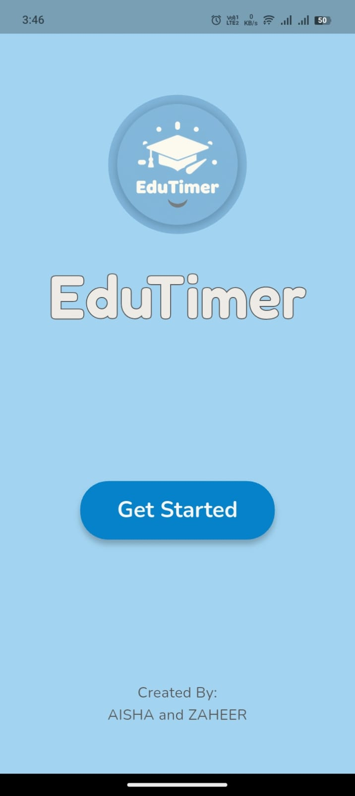
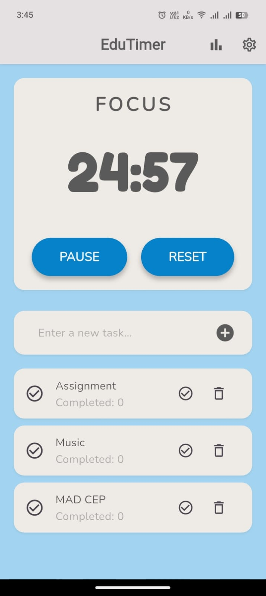
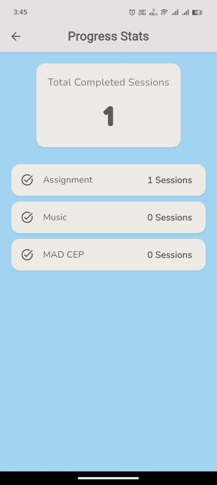

# EduTimer - A Focus & Productivity App
<p align="center">
  
</p>

A beautiful, cross-platform Pomodoro timer and task management app built with Flutter. Designed to help students and professionals boost their productivity by structuring their focus sessions.

This project was developed as a Complex Engineering Problem (CEP) for the Mobile Application Development course (22SW).

---

## 📸 Screenshots

| Onboarding | Pomodoro (Main) |
| :---: | :---: | 
|  |  |

| Stats Screen | Settings Screen | 
| :---: | :---: |
|  |  | 

---

## ✨ Features

* **Customizable Timer:** Set custom durations for "Focus" and "Break" sessions.
* **Task Management:** Add, delete, and track tasks for your sessions.
* **Progress Stats:** A dedicated screen to track total completed sessions and stats per task.
* **Modern UI/UX:** A clean, light-blue and off-white theme consistent across the entire app.
* **Custom Logo & Onboarding:** A beautiful, welcoming splash screen with the app's logo and outlined text.
* **Local Notifications:** Get alerts when your session or break ends, even if the app is in the background.
* **Background Audio:** Calming sounds for focus and relaxing sounds for breaks.
* **Persistent Data:** All tasks, stats, and settings are saved locally on your device.

---

## 🛠️ Tech Stack & Key Packages

* **Framework:** Flutter
* **Database (Tasks & Stats):** `sqflite`
* **Storage (Settings):** `shared_preferences`
* **Notifications:** `flutter_local_notifications`
* **Audio:** `audioplayers`
* **UI & Fonts:** `google_fonts`

---

## 🚀 Getting Started (How to Run)

1.  **Clone the repository:**
    ```bash
    git clone [https://github.com/zaheer-ahmed77/EduTimer-Pomodoro-App.git](https://github.com/zaheer-ahmed77/EduTimer-Pomodoro-App.git)
    cd EduTimer-Pomodoro-App
    ```

2.  **Get dependencies:**
    ```bash
    flutter pub get
    ```

3.  **(IMPORTANT) Add Audio Files:**
    This project uses two local audio files that are not included in the repository. You must add them manually:
    * Create a folder: `assets/sounds/`
    * Add two `.mp3` files (e.g., from Pixabay): `focus_sound.mp3` and `break_sound.mp3`

4.  **Run the app:**
    ```bash
    flutter run
    ```
